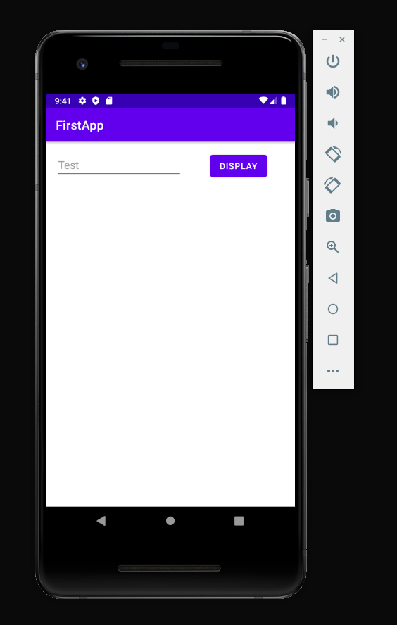

# Building Your First Android App

## Overview

### What You'll Learn

In this section, you'll learn:

1. How "activities" and "intents" play in the structure of Android apps
2. How to build a UI in the Layout Editor
3. How to switch and transfer information between screens with intents

### Prerequisites

1. [Getting Started with Android](getting-started.md)

### Introduction

Now that we know our way around Android Studio, let's build a simple app! **It'll just accept some text, let you press a button, and present that text on a different screen!**

## Android App Structure

Before we get into the specifics of building your app, we have to talk about how Android apps work in general.

### Activities

Each screen in your Android app is called an "activity". When using your app, users flow through the different activities as they interact with your app. You can think of activities as the different states your app can be in at any given time, and different user inputs may cause a transition to a different state.

Let's consider the app we'll be making -- it has two activities: one where a user can enter a message and press a *Display* button, and one where the user views the message they wrote. A state diagram for our app might look something like this:


Now, this is a little bit of an oversimplification -- we haven't discussed how we actually transition, which is what "intents" are for.

### Intents

To switch from one activity to another, Android provides an intent system. Intents allow an activity to tell the Android OS that it would like to open another activity (not necessarily from the same app). The OS then accepts the intent if it's valid and the app has the permissions to request it, triggering a new activity to start.

With regard to our application, that'll make our state graph look a little more like this:


This might seem a little clunky, but it makes sense when considering how apps can talk to one another in Android. For example, when you have a photo you'd like to share from the Photos app, Android provides you with a list of apps that you can share through -- the thing these apps have in common is that they have an activity that can be opened by a photo sharing intent!

## Designing Our App's Main Activity

We'll start off our app by putting the UI elements we'd like in place.

1. Open up `activity_main.xml`.
2. We're gonna tweak a couple editor settings to make this easier...
   1. Click the eye icon in the top left just above the preview and select *Design*. This view will let you preview the app -- *Blueprint* mode doesn't render the app the way it'll be seen on the phone.
   2. Two buttons to the right of the eye icon, you'll see the margin selector. Set it to whatever you'd like -- 16dp is pretty good.
3. Click on and delete the "Hello World!" `TextView` on the .
4. Go into the *Palette* menu on the left hand side of the Layout Editor, and click the *Text* button to pull up the available text-related widgets (or "views", as they're known in Android).
5. Click and drag a *Plain Text* over onto the display, and plop it somewhere in the upper-right.
6. Click the *Buttons* button to pull up the kinds of buttons you can add, and drag-and-drop a *Button* view next to the *Plain Text* view.

Cool! We've got these two elements in place now, but we're not quite done making the UI for the main activity yet -- if you look over at the Component Tree in the lower left side of the Layout Editor, then you'll see a couple of errors.

### Constraints

If you hover over the errors, it'll tell you that the elements "aren't constrained". In Android, you need to not only plop elements on the screen, but you also need to tell Android where to place them relative to the screen borders or one another -- these rules are known as "constraints".

To constrain the elements, click on one and click one vertically-facing circle and one horizontally-facing circle. This will tell Android Studio where to place your elements relative to others on both the X and Y axes. It may not be perfect, but thankfully there are many ways to align and arrange elements in Android Studio; sadly, we won't cover them in this workshop.

### Strings

Now that we've fixed the constraint issue, we're left with a warning in the Component Tree. This warning now yells at us about some "Hardcoded string __, should use `@string` resource".

As mentioned while going over the files in an Android Studio project, Android apps should have every UI-facing string defined in `strings.xml`. Thus, the IDE wants us to define such strings for the default text in the *Plain Text* and *Button* views.

#### 1. Adding the *Button* string

1. Click on the *Button*, and find `text` in the Attributes menu on the right. Delete whatever text is there.
2. Open `strings.xml` -- it's under `res/values/`.
3. In the top bar of the code editor, click *Open editor*.
4. Click the + sign to add a new string -- put something like `edit_message` for the *Key*, and `Enter a message` for the *Default Value*. Press *OK*.
5. Go back to the Layout Editor for the main activity.
6. Click the small dark bar to the right of the `text` attribute -- this will open a menu that'll let you choose your `edit_message` string.

#### 2. Adding the *Plain Text* string

1. Repeat step 1 from before, but delete the string inside of `text` and find the `hint` attribute.
2. Add a string to `strings.xml` with *Key* `button` and *Value* `Display`
3. Connect the new string to the `hint` attribute.

There should be no more warnings now! Feel free to test your app as is -- it won't do anything, but we'll fix that in the next section.

Here's roughly how your app should look:



## Adding the Display Activity

Now that we've got a place to enter some text and a button to trigger a transition, let's make it so that when we press the button, the text is transferred to a new activity and displayed on-screen.

### Creating the Activity

1. Right click on the `app/` folder in the file tree. Click *New > Activity > Empty Activity*.
2. Name it `DisplayMessageActivity`, and leave everything else as default. Click *Finish*.

### Coding the Main Activity

Now, we have to make it so that when the user presses the *Display* button, they're brought into our new activity. To do this, we need to bind a function to the button that creates an intent, puts the entered message into the intent, and sends it.

Add this function below `onCreate()` in `MainActivity.java ` (explained line-by-line):

```java
public void sendMessage(View view)
{
    // Create an intent, with this MainActivity as the requester and DisplayMessageActivity
    // as the activity we'd like to enter.
    Intent intent = new Intent(this, DisplayMessageActivity.class);
    
    // Get access to the Plain Text (AKA EditText) view.
    // findViewById is an Android function that returns the view specified by a given resource ID.
    // R is an Android object that represents all the resources in the app. By accessing the ID
    // of editTextTextPersonName, we get the Plain Text view -- it's not entirely clear how it
    // gets a name that convoluted, but if yours is different it should suggest the right one
    // after you put the last . in that line.
    EditText editText = (EditText) findViewById(R.id.editTextTextPersonName);
    
    // Extract the string in the EditText view
    String message = editText.getText().toString();
    
    // Add the string as extra information in the intent, and make it available by the name
    // "com.example.firstapp.MESSAGE". Kinda gross, but that's just how it is.
    intent.putExtra("com.example.firstapp.MESSAGE", message);
    
    // Send the intent and switch to the other activity.
    startActivity(intent);
}
```

Now that we have the logic for the button down, go back to the Layout Editor, select the button, and set the `onClick` attribute to `sendMessage`.

Now, your button will work! Feel free to test it out -- your `DisplayActivity` will be a blank screen, though, so let's get to that.

### Building the Display Activity UI

1. Open up `activity_display_message.xml` -- it's under `res/layout/`.
2. Add a *Text > TextView* view to the activity, and set its constraints.

### Coding the Display Activity

Our main activity takes no information when it first spawns (in `onCreate()`) -- however, our display activity will only be started when the button is pressed, and it needs access to the provided text when it is created.

Inside of `onCreate()` in `DisplayMessageActivity.java`, add the following code:

```java
// Get access to the intent that created this activity.
Intent intent = getIntent();

// Access the provided string with the key we paired it with.
String message = intent.getStringExtra("com.example.firstapp.MESSAGE");

// Get access to the TextView we put on this activity.
TextView textView = findViewById(R.id.textView);

// Set its text to the message we sent.
textView.setText(message);
```

And that should be it! You now have an app that should be fully functional!

### Adding Navigation

To add a *Back* button and a proper relationship between our two activities, let's make the display activity a child of the main activity.

Change the `.DisplayMessageActivity` entry in `AndroidManifest.xml` to contain the following to create this relationship:

```xml
<activity android:name=".DisplayMessageActivity"
          android:parentActivityName=".MainActivity">
</activity>
```

Now, your app is complete! Here's what it should look like in your display activity (note the back arrow in the top left!):


